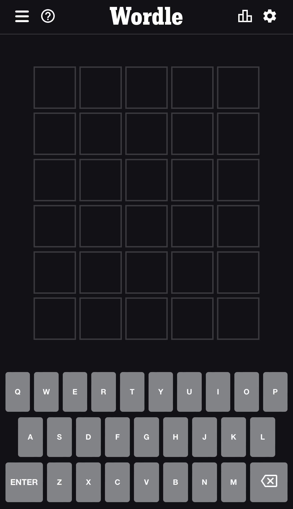
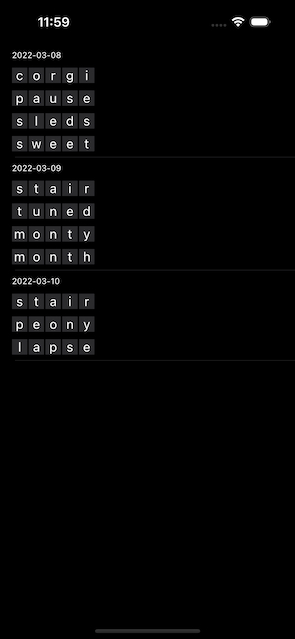

# iOS Engineering Challenge



# Description

At Shareup, we love to play [Wordle](https://www.nytimes.com/games/wordle/). We have a channel in our company Discord dedicated to sharing our Wordle scores each day.

Although we love Wordle, we wish there was a way to look back at our previous performances to see how well we did and compare them with others.

We’ve created a basic prototype Wordle app to store and display your previous Wordle scores, which looks like this:



Your challenge will be to modify the app to display the previous Wordle scores in an attractive and interesting way. The design should be inspired by Wordle’s native way of showing a person’s score, which looks like this:

> Wordle 281 4/6
> 
> ⬛⬛⬛⬛🟨<br>
> 🟨⬛🟨⬛⬛<br>
> ⬛⬛⬛🟨⬛<br>
> 🟩🟩🟩🟩🟩

_The above score was for the word “nymph”. The guesses were “train”, “ponds”, “blume”, and “nymph”._

The gray squares represent incorrect letters. The yellow squares represent letters that exist in the target word, but are in the wrong position. The green squares are correct letters.

# Requirements

The app needs to:

- **Be written in Swift**
- **Use UIKit** *(not SwiftUI)*
- Use the correct colors to represent if a letter was incorrect, correct but in the wrong position, or completely correct.
- Hide the letters until the user taps on the cell.
- Show the letters when the user taps on the cell.
- **Please include a `README.md` in which you explain the design you came up with and the next improvements you'd make if you had time.**

# Goals

In creating this challenge, **we are mostly trying to assess your proficiency at building high-quality, interactive user interfaces using UIKit**. Although the basic requirements of this challenge are simple, we’re interested to see how comfortable you are using UIKit to design compelling user experiences. Additionally, we're interested in seeing how you come up with an algorithm for calculating the correct color for each letter in a guess.

# Starting point

We’ve put together a basic iPhone app that is capable of fetching scores from the server, decoding them into the local model, and displaying them in a modern `UICollectionView`. Additionally, we’ve written an empty algorithm to transform a guess into the Wordle tiles (e.g., from “ponds” to “🟨⬛🟨⬛⬛”) and with a failing test in the Core Swift package. The views include Xcode Previews to enable quick prototyping, and the model layer is tested.

---

### Wordle Scores API

We’ve built an API you can use to fetch Wordle scores. It's not necessary to use this API inside of your app because we've supplied a mock, but we may use it in the follow-up interview. So, you may want to test it out.

In order to access the API, you’ll need to include an `Authorization` header with your personal access token, which you'll receive in an email.

Although the Wordle Scores API supports creating and deleting scores, those APIs are mostly available to aid you in developing and debugging your app. You should only need to use the “List scores” API inside of your app.

### List scores

```other
curl -XGET -H'X-Authorization: ACCESS_TOKEN' https://wordle.shareup.fun/scores
```

### Get a single score

```other
curl -XGET -H'X-Authorization: ACCESS_TOKEN' https://wordle.shareup.fun/scores/{id}
```

### Create a new score

```other
curl -XPOST -H'X-Authorization: ACCESS_TOKEN' -H'Content-Type: application/json' -d'{"id": 262, "date": "2022-03-08", "word": "sweet", "tries": ["corgi", "pause", "sleds", "sweet"]}' https://wordle.shareup.fun/scores
```

### Delete all scores

```other
curl -XDELETE -H'X-Authorization: ACCESS_TOKEN' https://wordle.shareup.fun/scores
```

This call actually resets your account’s scores to the initial state, which means your account will have three scores in it after this call completes.

### Delete a single score

```other
curl -XDELETE -H'X-Authorization: ACCESS_TOKEN' https://wordle.shareup.fun/scores/{id}
```

### Responses

Depending on the request, you'll either get back a JSON object or an array of JSON objects. In either case, the core type you'll receive back is a `score`, which has the following shape:

```json
{
  "id": 262,
  "date": "2022-03-08",
  "word": "sweet",
  "tries": ["corgi", "pause", "sleds", "sweet"]
}
```

In the case of an error, you may or may not receive a JSON object with an `error` key explaining the problem.

```json
{ "error": "missing id" }
```

